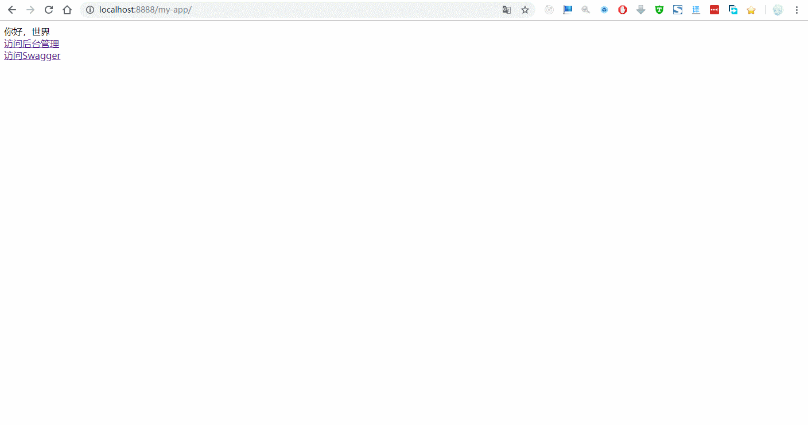
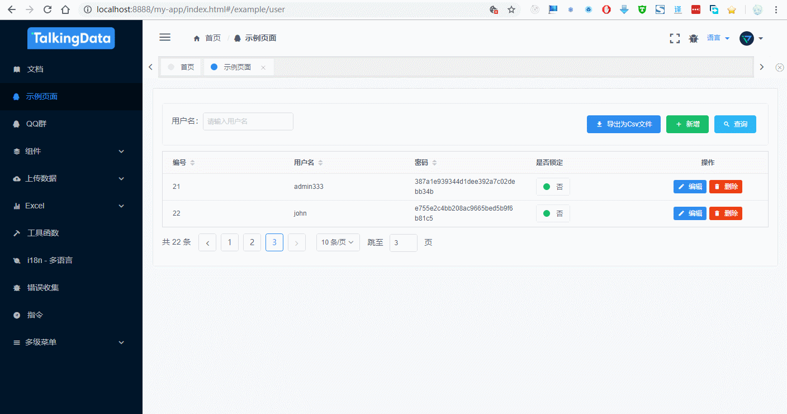

# wetech-spring-boot-vue-example

## 项目介绍

Spring Boot + Mybatis + Mapper + PageHelper + Swagger  + Vue.js 整合示例工程，包含前后端增删改查示例代码。

## 软件架构
### 后端技术

技术 | 名称 | 版本 | 官网
----|------|----|----
Spring Boot | 应用框架 | 2.0.0.RELEASE | [https://projects.spring.io/spring-boot/](https://projects.spring.io/spring-boot/)
MyBatis | ORM框架 | 3.2.1 |  [http://www.mybatis.org/mybatis-3/zh/index.html](http://www.mybatis.org/mybatis-3/zh/index.html)
Mapper | MyBatis 通用 Mapper4 | 4.0.0 |  [https://gitee.com/free/Mapper](https://gitee.com/free/Mapper)
PageHelper | MyBatis 分页插件 | 5.1.2 |  [https://gitee.com/free/Mybatis_PageHelper](https://gitee.com/free/Mybatis_PageHelper)
MyBatis Generator | 代码生成 | 1.3.5 |  [http://www.mybatis.org/generator/index.html](http://www.mybatis.org/generator/index.html)
Swagger2 | 在线Api文档 | 2.7.0 |  [https://swagger.io/](https://swagger.io/)
Maven | 项目构建管理 | 4.0.0 |  [http://maven.apache.org](http://maven.apache.org/)

### 前端技术

技术 | 名称 | 版本 |  官网
----|------|----|----
Vue.js | 优秀的Javascript库 | 2.5.10 |  [https://cn.vuejs.org/](https://cn.vuejs.org/)
iView Admin | 优秀的Javascript库 | 2.1.0 |  [https://admin.iviewui.com](https://admin.iviewui.com)

### 软件需求

- JDK1.8+
- MySQL5.6+
- Maven3.0+

## 安装教程

1. 通过git下载源码
2. 创建数据库my_app，数据库编码为UTF-8
3. 依次执行docs/sql/schema.sql和docs/sql/data.sql文件，初始化数据
3. 修改application-dev.properties文件，更新MySQL账号和密码
4. 运行Maven命令mvn install(注意：安装wetech-admin模块因为会运行npm install和npm build命令时间会比较长，当然也可以手动在wetech-admin模块执行npm命令)
5. 运行MyAppApplication类，启动项目
6. 项目访问路径：http://localhost:8888/my-app

## 代码生成器

已集成通用 Mapper 专用代码生成器Maven插件，使用该插件可以很方便的生成实体类、Mapper接口以及对应的XML文件。

首先对MBG不太了解的可以先阅读下面的文档

[Mybatis Geneator 详解](https://blog.csdn.net/isea533/article/details/42102297)

通用 Mapper 专用代码生成器生成的 Model 会在原有基础上增加 @Table,@Id,@Column 等注解，方便自动会数据库字段进行映射。

运行代码生成器需要使用命令

`mvn mybatis-generator:generate`

## 预览图

> iView admin

> crud

> swagger

